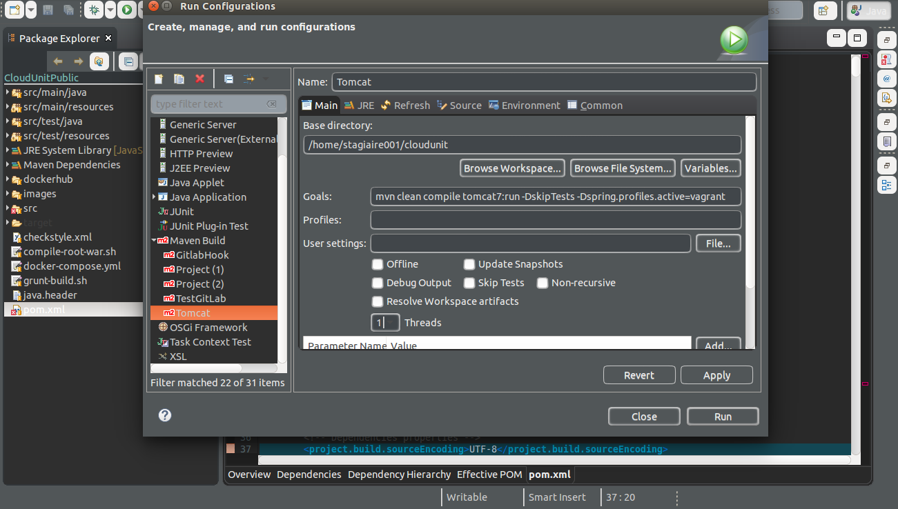

# CloudUnit developement environment

You are reading the wright guide, if you want to setup an environment to contribute to CloudUnit development.

## Requirements

* Windows
* Git (https://git-scm.com/download/win)
* Java 1.8 (http://www.java.com/fr/download/win10.jsp)
* Python 2.7+ (https://www.python.org/) - install before NodeJS
* NodeJS 5+ (https://nodejs.org/dist/latest-v5.x/) - file “node-v5.11.0-x(64/86).msi
	file “node-v5.11.0-x64.msi for 64 bits system
	file “node-v5.11.0-x86.msi for 32 bits system
* Virtualbox 5.0.4+ (https://www.virtualbox.org/wiki/Downloads) - Install before Vagrant
* Vagrant 1.8 (https://www.vagrantup.com/downloads.html)
* Maven 3+ (http://mirrors.ircam.fr/pub/apache/maven/maven-3/3.3.9/binaries/apache-maven-3.3.9-bin.zip)


## Architecture for developpment

    

### General Rules

* You have to configure a local dns (see further) to send any requests from your host to VM (IP fixed at 192.168.50.4) 
* You use your favorite idea (intellij, Eclipse) to develop the maven project into 'cloudunit/cu-manager'.
* The backend is a spring application exposing a REST API
* The frontend is an AngularJS 1.4 consuming the backend API from Spring Java
* You run the project with an embedded tomcat via maven tasks (tomcat:run). No need to install Tomcat locally.
* Mysql is included into vagrantbox so no need to install it locally.

### Architecture sources

```
cloudunit/cu-manager  : Maven project 
cloudunit/cu-plaform  : Shell scripts for administration 
cloudunit/cu-services : Docker images
```

## Installation 

#You can use script to autoinstall step 1 to 5 :
#```
#curl -sL https://raw.githubusercontent.com/Treeptik/cloudunit/master/documentation/scripts/ubuntu-15.10.sh | bash
#```

### Step 1 - Local DNS

TODO

### Step 2 - How to install Vagrant plugins

* Open a command prompt (Windows+R then cmd)
```
vagrant plugin install vagrant-reload
vagrant plugin install vagrant-vbguest
```

### Step 3 - How to install source code

* Open a command prompt (Windows+R then cmd)
```
cd %HOMEPATH% && git clone https://github.com/Treeptik/cloudunit.git
```

### Step 4 - How to install Maven

## JDK and JAVA_HOME
* Make sure JDK is installed. For that, open a command prompt (Windows+R then cmd) and launch command line : java -version
* Make sure JAVA_HOME variable is added as Windows environment variable. For that, open “Control Panel”, “System Menu”, “Advenced system parameters” and then “Environment variables”. Check “JAVA_HOME” is setted in “System variables”. If not, add new variable JAVA_HOME with value : “C:\Program Files\Java\<folder of Java Development Kit>”. Click on ok.
## Download Apache Maven
* Download Maven archive and unzip it in “C:\Program Files\Apache\maven”.
## Add M2_HOME and MAVEN_HOME
* In the same way of JAVA_HOME, add M2_HOME and MAVEN_HOME with value : “C:\Program Files\Apache\maven”
## Add to PATH
* In “Environment variables” window, update “Path” variable is “System variables” and add “;%M2_HOME%\bin”
## Verification.
* In command prompt, launch command line “mvn -version” to check installation is done.


### Step 5 - How to install Angular Project dependencies 

Open a command prompt (Windows+R then cmd)
```
npm install -g grunt grunt-cli bower 
cd %HOMEPATH%/cloudunit/cu-manager/src/main/webapp && npm install
cd %HOMEPATH%/cloudunit/cu-manager/src/main/webapp && bower install
```

### Step 6 - How to build the vagrant box

Warning because this step could need lot of times !

```
$ cd %HOMEPATH%/cloudunit/cu-vagrant 
$ vagrant up
$ vagrant provision
```

### Step 7 - How to start the application

TODO

# IDE CONFIGURATION

## ECLIPSE 

In your favorite IDE, select Import in File menu then **Existing Maven project**.
Into **root** directory, select **cu-manager** and Finish.
When you have **Setup Maven plugins connectors** window, click on Finish button.

Select **pom.xml** in the package explorer and right click to select.


You can run CloudUnit with a Maven task easily as :
    



## INTELLIJ

Open the project with your favorite IDE into **root** directory and add **cu-manager** as Maven Project.
Simply select the **pom.xml** and right click to select this option.


You can run CloudUnit with a Maven task easily as :
    


# FAQ

All questions and answers about dev tasks

## How to reset Environment Development

```
vagrant ssh
cloudunit/cu-platform/reset-all.sh -y
```

## How to rebuild images

Update your sources, build the images and reninit the database :

```
$ vagrant ssh dev
$ cloudunit/cu-services/build-services.sh
$ cloudunit/cu-platform/reset-all.sh -y
```
